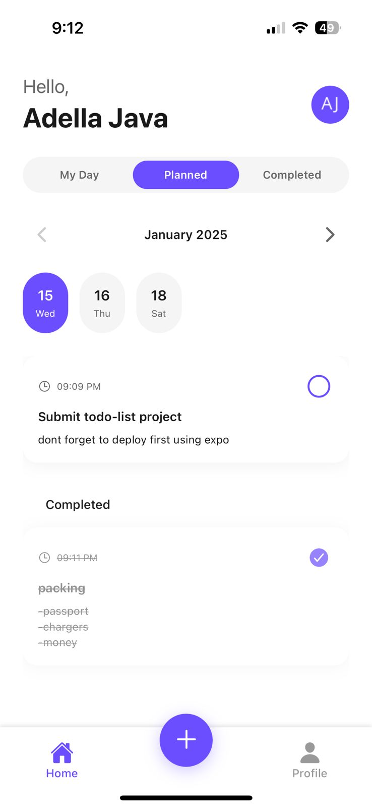
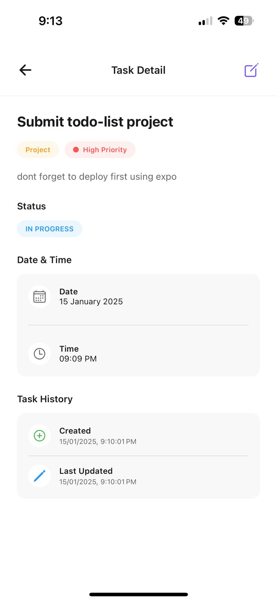
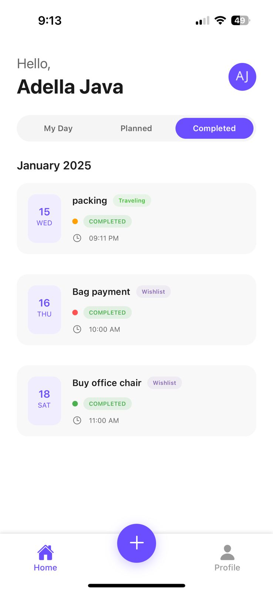
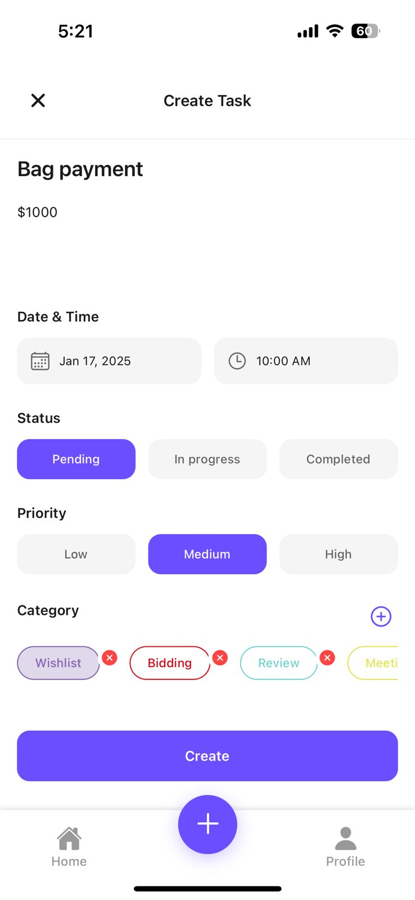

# 📝 To-Do List App

A beautiful and intuitive To-Do List mobile application built with Expo React Native and TypeScript.

## 🛠 Tech Stack

- **Frontend**

  - Expo React Native
  - TypeScript
  - Redux Toolkit
  - React Navigation

- **Backend**
  - Node.js
  - Express
  - MongoDB
  - JWT Authentication

## 📱 App Screenshots

<div style="display: flex; flex-direction: row; gap: 10px;">

### 🏠 Home Screen


### ✨ Task Details


### ✅ Completed Tasks


### ➕ Create New Task


</div>

## 📲 Try the App

### iOS Preview

Scan this QR code with your iOS device:

[Expo Preview Link](https://expo.dev/preview/update?message=feat%3A%20api&updateRuntimeVersion=1.0.0&createdAt=2025-01-15T18%3A01%3A31.988Z&slug=exp&projectId=a0943736-2677-4d48-a8c5-a85a4e1dcdde&group=dfcec23f-9e47-4c9b-a2f2-4b022ca8eec7)

## 🚀 Getting Started

1. **Clone the repository**

```bash
git clone [your-repo-url]
cd to-do-list-app
```

2. **Install dependencies**

```bash
cd app
npm install
```

3. **Start the development server**

```bash
npm start
```

## 🌐 API Endpoints

The app connects to a custom backend deployed at:

```
http://todolist.adellajava.tech
```

## 👩‍💻 Developer

Built with ❤️ by Adella Java

## 📄 License

This project is licensed under the MIT License - see the LICENSE file for details
